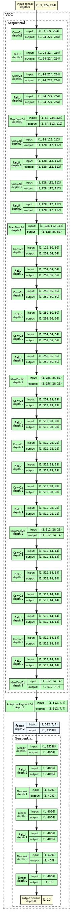
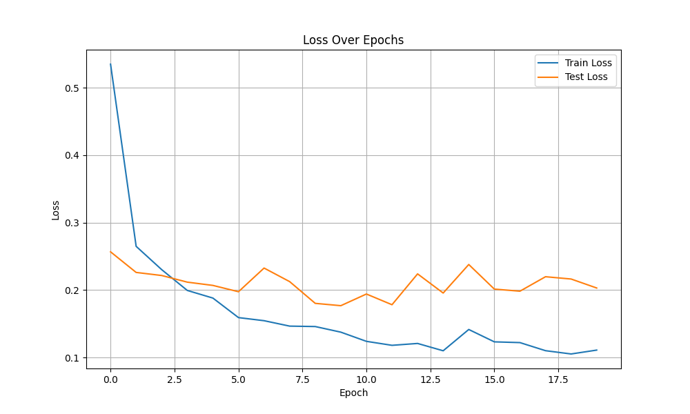
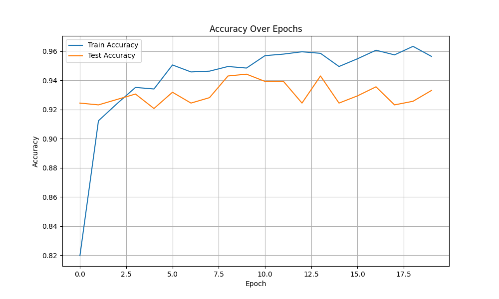

# Project Readme

## Overview
This project consists of Python scripts to train a model and plot results. It includes:
- **`main.py`**: The entry point script to train and test the model.
- **`models.py`**: Contains model definitions and an example of how to generate a loss plot.

The model trained is the vgg16 model only training the last layer.




## Prerequisites
The same as the previous week and 2 new:

- `torchview`
- `grad-cam`

You can install the required libraries using pip:
```bash
pip install torchview grad-cam
```

## Usage

### 1. Run the training script
The main script (`main.py`) is designed to:
- Train the model.
- Evaluate it on test data.
- Save the model and results.

To execute the script, run the following command:
```bash
python main.py
```

Ensure you have set up the appropriate parameters (like epochs, learning rate, etc.) in the script before running.

### 2. Model Definitions
`models.py` contains the architecture and helper functions for the model.

Also in the file `models.py` there is a sample code to extract feature maps and grad activation maps and plot them, try it by executing:

```bash
python models.py
```

### 3. View Results
After running the training script, you can visualize the loss using the provided plot `loss.png`.

### Evaluation Plots




## Notes
- Modify parameters in the scripts as needed for your specific dataset or model.
- Ensure `loss.png` is in the same directory as the scripts to view the provided sample plot.

